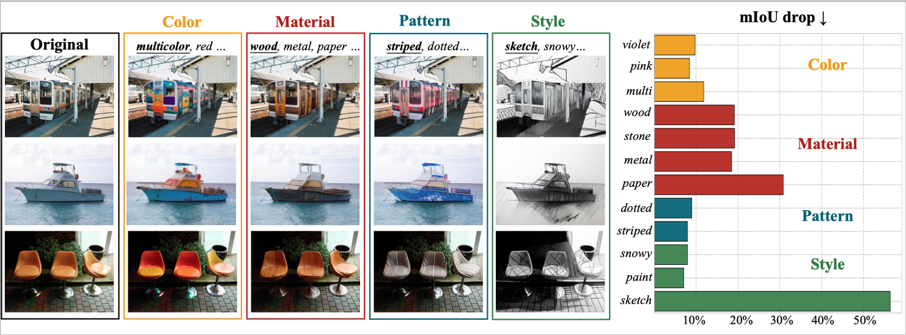
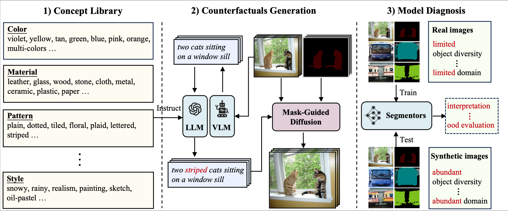

# Benchmarking Segmentation Models with Mask-Preserved Attribute Editing

This codebase provides the official PyTorch implementation of our CVPR 2024 paper:
> Benchmarking Segmentation Models with Mask-Preserved Attribute Editing <br />
> Zijin Yin, Kongming Liang, Bing Li, Zhanyu Ma, Jun Guo <br />
> *In IEEE/CVF Conference on Computer Vision and Pattern Recognition(CVPR) 2024*

[](https://arxiv.org/abs/2403.01231)

## TL;DR
We generate diverse synthetic samples by editing real images via diffusion models, and use synthetic-real pairs to evaluate semantic segmentation performances.
<p align="left">

</p>

---

<p align="left">

</p>

## Install
Install [mmsegmentation](https://github.com/open-mmlab/mmsegmentation/blob/main/docs/en/get_started.md#installation)
```shell
pip install -U openmim
mim install mmengine
mim install "mmcv>=2.0.0"
pip install "mmsegmentation>=1.0.0"
pip install "mmdet>=3.0.0rc4"
```

Install [diffusers](https://huggingface.co/docs/diffusers/index) and [transformers](https://huggingface.co/docs/transformers/index).
```shell
pip install diffusers==0.17.1
pip install transformers==4.26.1
```
## Get Started
Please refer to [dataset_prepare.md](docs/dataset_prepare.md) for dataset preparation, [text_edit.md](docs/text_edit.md) for image caption editing, [image_edit.md](docs/image_edit.md) for image editing (our work mainly focuses on this part), [filter.md](docs/filter.md) for noisy filtering strategy.

## Acknowledgment
Our code is built on top of several excellent research codebases and models, including [PnP](https://github.com/MichalGeyer/pnp-diffusers), [LLAMA](https://huggingface.co/docs/transformers/model_doc/llama3), and [LLaVA](https://huggingface.co/llava-hf/llava-1.5-7b-hf), and additionally borrows mask filtering strategy from [FreeMask](https://github.com/LiheYoung/FreeMask), clip directional similarity metric from [LANCE](https://github.com/virajprabhu/LANCE). Thanks for their contributions!
